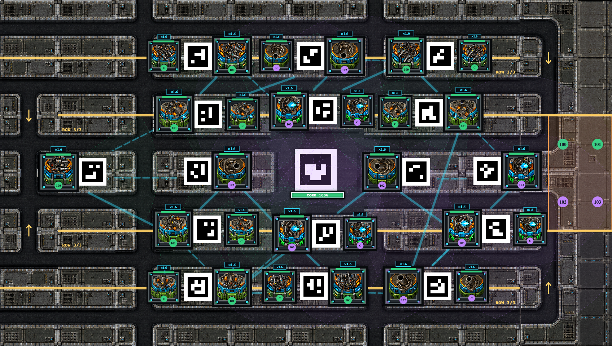

# L4 companion turrets

Implemented and verified in the workspace on 2026-09-08. Level revision 19
supplies twelve companion anchors. L4 Machine Guns, Flamethrowers, Mortars and
Tesla Coils create a same-type companion across their existing ArUco code.
Codes **47, 48, 50 and 54** in the middle line remain single.

Original pods stay at 112 px; companions use 96 px pods and proportionally
scaled L4 art. The pair shares health, ownership and aim/spread inputs. Each gun
targets from its own position with independent charge, cooldown and firing.
Companions inherit the parent's damage/link bonus without adding topology
participants, physical markers, purchases or saved-profile records.



## Activation and use

1. Restart the hub when the current run has ended to load the updated Python
   modules. This implementation did not restart the live hub, reset a live game,
   or modify saved player profiles/settings.
2. Reset into layout revision 19 and refresh the game and external display pages.
3. In Virtual play, choose **Virtual test unlocks → Unlock all L4**, then place
   weapons. Eligible placements add a pod marked `C` after normal activation.
   Sixteen primary placements produce twelve companions.
4. Click either gun to control the pair. L3 removes that weapon's companions;
   L4 restores them through normal activation without healing/resetting the
   primary. Locking placement preserves already installed units.
5. Scored games derive L4 from the run's saved player levels. Both LTZ Score
   tabs describe the benefit and the middle-line exception.

Enemy contact near either pod damages the shared health pool once per enemy
over overlapping contact intervals. Parent destruction disables both guns;
dead companion records remain for destruction rendering until replacement or
reset. Replenishment heals the pair once. Already launched mortar rounds retain
their launch origins through downgrade/replacement and finish normally.

## Validation

- **167 Photon tests and 12 LTZ integration tests passed.** Companion coverage
  includes all weapons/levels/sockets, invalid and legacy descriptors, shared
  aim/health, activation, idempotent upgrades, destruction/replacement,
  replenishment, physical L4 profiles, contact union, independent fire and
  projectiles, unchanged topology, atomic rejection of an overlapping layout
  edit, and one authoritative kill increment per enemy.
- The legacy comparison explicitly asserts no companions on old levels before
  comparing unchanged gameplay; it excludes only the additive snapshot fields.
- The real isolated Game/Y browser checks passed: both views, 28 units, all
  **224 unit/angle combinations** within their pods, middle-line exclusions,
  companion selection controlling its parent, promotion/demotion, reconnect
  and reset. Maximum art extent was 83.1% of the pod half-width.
- Existing virtual-unlock and LTZ browser checks passed, covering persistence,
  score history, control selection and upgraded art on both views. Test servers
  used temporary state and no robot modules.
- The current project modular audit passed: 18 ground modules, 61 road modules,
  105 tile objects, no visible reference layers, two spawn groups, and all
  sixteen row states. Tiled 1.12.2 exported and rasterized the map successfully.
  The native render and fully loaded game views were visually inspected.
  The historical generic skill validator assumes four spawns/eight structures;
  the project's existing v2-aware validator checks the current topology.

## Performance and limits

On this macOS 15.6.1 arm64 host, headless Chrome replayed 1,000 orcs with heavy
Tesla/flame/mortar/core effects and both displays for 60 seconds per scenario.
The baseline used identical L4 primary art and fields with companions omitted.

| Display scenario | Operator median/min FPS | External median/min FPS | Samples at or below 30 FPS |
| --- | --- | --- | --- |
| 16 primary weapons | 60 / 46 | 60 / 42 | 0 |
| 16 primaries + 12 companions | 60 / 46 | 60 / 46 | 0 |

Both scenarios loaded all 88 assets without browser errors. These are measured
desktop replays, not guarantees for every device or display configuration.

A separate authoritative simulation replay held 1,000 enemies alive for 480
ticks and cycled all sixteen row states. Conservative bounding-box rejection
avoids expensive companion contact-union checks for distant enemies.

| Server scenario | Median tick | 95th percentile tick | Pending reroutes at end |
| --- | --- | --- | --- |
| L4 primaries without companions | 38.0 ms | 60.7 ms | 0 |
| L4 primaries with companions | 42.8 ms | 100.6 ms | 0 |

Both cases exceeded a 33.3 ms tick budget in this extreme synthetic test. This
does **not** establish real-time simulation at maximum load. Companions add
combat work. Both runs completed with 1,000 enemies, 17 routing builds, no
pending reroutes and the same 51 queued spawns. Raw measurements are saved in
`L4_COMPANION_VERIFICATION_2026-09-08.json`.

## Reproduction

From `manual-override/`:

```sh
.venv/bin/python -m unittest discover -s tests -p 'test_photon_*.py'
.venv/bin/python -m unittest discover -s tests -p 'test_ltz_integration.py'
.venv/bin/python tests/virtual_upgrades_fixture.py
```

In another terminal, with Playwright on `NODE_PATH`, run
`node tests/companions_browser.cjs` and `node tests/virtual_upgrades_browser.cjs`
sequentially, then stop the fixture. LTZ verification uses
`tests/ltz_browser_fixture.py` with `tests/ltz_browser.cjs`.

`photon_performance_fixture.build_fixture(1000, upgrade_level=4)` builds the
28-unit replay; remove only its `companions` array for the 16-unit comparison.
Enable `__peakEffects` and run `tests/photon_browser_performance.cjs` with 60
seconds and two views. Server comparison uses
`photon_row_simulation.run(upgrade_level=4)`, with `enable_companions=False` for
the baseline. Neither fixture touches the live hub.
