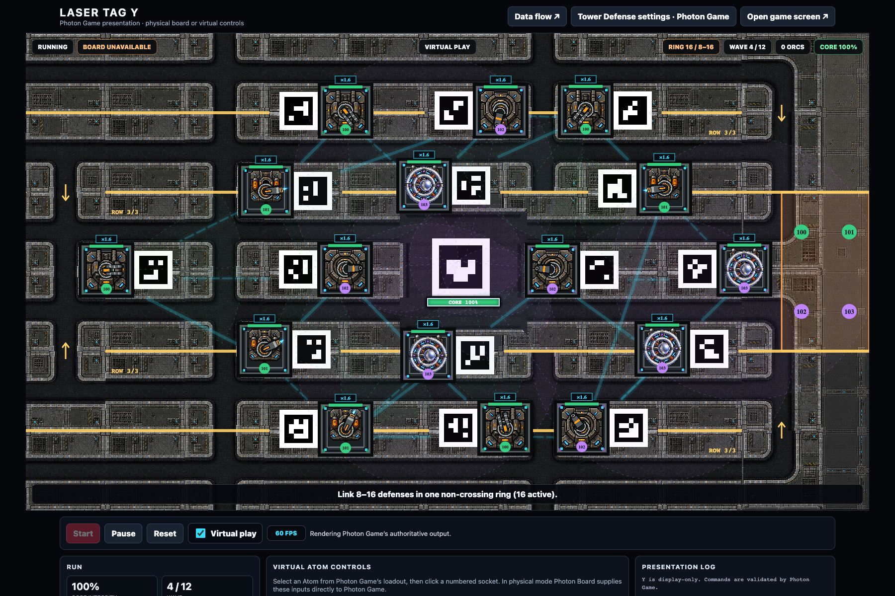

# Row barrier implementation and validation

Implemented against Photon Level revision 18. Four independent three-turret
rows now control alternating right/left openings alongside ordinary links.
Only the outer top-left and bottom-left entrances spawn enemies. Destruction
reopens a row; replacement restores it after normal activation. Wave totals,
Brute cadence, health, damage, and size settings are preserved.



## Gameplay checks

The complete repository suite passed: **242 tests**. The final whitespace/diff
check also passed.

The new smoke coverage verifies all 32 entrance/barrier-mask reachability cases,
all 12 contributor destruction/replacement cases, completed activation timing,
ordinary-link preservation, strict spawn fallbacks, congestion queues, mid-edge
closures without teleportation, bounded shared rerouting, swept collision for
fast/large bodies, crowd separation, full physical traversal of both winding
routes, malformed contracts, layout-edit rejection, v1 compatibility, pending
revision installation after reset, and server scheduling. Rendering coverage
checks powered/broken labels and geometry retained across incremental updates.

Fully locked graph routes measure 4,160 px, versus 1,280 px with rows unpowered.
This increases exposure time; no automatic enemy-balance compensation was added.

## Browser performance

Final isolated Chrome replay: 10 minutes, two simultaneous real Y views,
1,000 enemies including Brutes, 16 turrets, burning/electrical/mortar/core
visual effects, and repeated transitions through all 16 row masks. The replay
uses the corrected SSE receiver, so row geometry persists throughout updates.

| Measurement | Gamemaster | External screen |
| --- | ---: | ---: |
| Median visible FPS | 60 | 60 |
| Minimum reported FPS | 44 | 43 |
| Reports at or below 30 FPS | 0 | 0 |
| 95th percentile frame interval | 17.3 ms | 18.0 ms |
| 99th percentile frame interval | 18.7 ms | 18.7 ms |
| Browser long tasks | 0 | 0 |
| Failed assets / script errors | 0 / 0 | 0 / 0 |

These are browser replay measurements on this machine, not a guarantee for
all devices or a measurement of the current live game. The preview separately
shows all four rows powered with ordinary links and unobscured marker artwork.

## Server performance

An isolated authoritative-engine replay held 1,000 enemies alive with fixture
HP, exercised all 16 row masks over 480 ticks, and kept normal combat logic.
The final run measured 31.6 ms median, 40.2 ms at the 95th percentile, and
86.2 ms maximum. The server's existing target is 20 Hz (a 50 ms budget), which
is separate from the display's 60 FPS target. Occasional ticks exceed that
budget; the deadline scheduler avoids an extra post-work delay and unbounded
catch-up. The test does not assert a 30 Hz simulation guarantee.

There were 17 shared routing-table builds including initial spawning, and
zero pending reroutes at the end. Each topology batch processes at most 48
enemies; strict collision applies immediately to those still waiting. The
51 scheduled spawns held behind the 1,000-enemy cap remain queued.

Profiling prompted conservative bounds before exact melee/field/flame contact,
a bounded shared road-geometry cache, shared costs per routing batch, staggered
edge bookkeeping, and deadline-based scheduling. Full regression checks cover
these changes, including fast swept melee and legacy simulation compatibility.

## Map verification and rollout

The modular audit passed: 18 ground modules, 61 road objects, 105 tile objects,
19 placed GIDs out of 56 referenced, no visible image/reference layers,
16 sockets, two entrances, and all 16 barrier masks. Asset families and alpha
bounds were inspected without altering the existing normalized bitmaps.

Tiled 1.12.2 successfully round-tripped all 15 layers/eight tilesets and rendered
an inspected native PNG. Both that render and the browser preview are saved
beside this report. The project validator applies the current two-spawn,
16-turret contract in place of the historical skill validator's older limits.

Python changes require the game server to reload. The running game was not
restarted or reset during this work. With the new code loaded, an active run
retains its frozen layout and a reset/new run adopts the new level revision.
Legacy Laser Tag Z keeps its v1 rollback behavior; production Photon Game/Y
use the new contract.

Reproduce:

```sh
.venv/bin/python -m unittest discover -s tests
.venv/bin/python tests/photon_row_simulation.py /tmp/row-simulation.json
node tests/photon_performance_renderer.cjs
```

`tools/validate_photon_map.py` uses Pillow from the bundled Python runtime.
`tests/photon_browser_performance.cjs` uses the bundled Playwright package and
local Chrome. Machine-readable measurements and the modular alpha audit are
in `ROW_BARRIER_VALIDATION_2026-09-05.json`.
